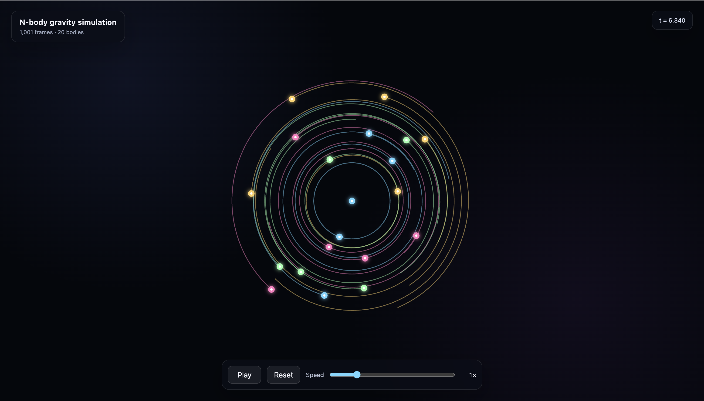
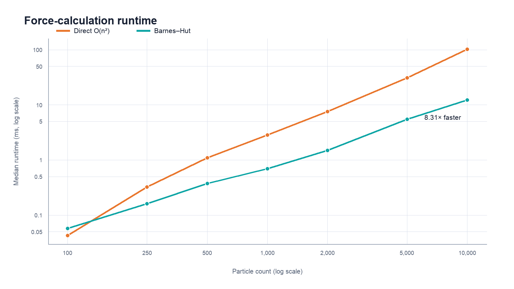
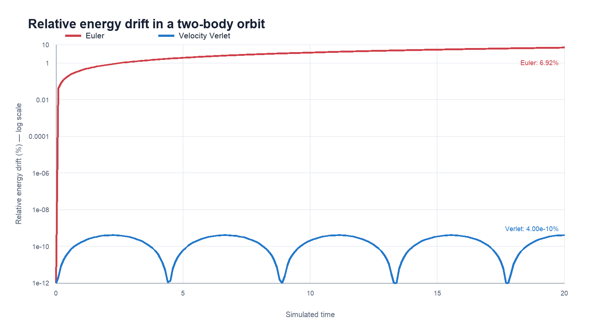
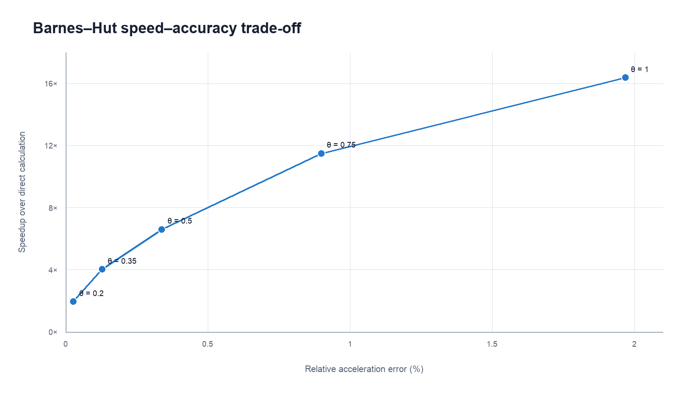

# N-Body Gravity Simulator

[](https://github.com/karimaboelsaad/N-body-simulation/actions/workflows/tests.yml)

A two-dimensional Newtonian gravity simulation written in C++. The project compares numerical integration methods and direct force calculation with the Barnes-Hut algorithm.



## Current features

- Direct O(n²) gravitational force calculation
- Barnes-Hut quadtree force approximation
- Direct-versus-Barnes-Hut acceleration error measurement
- Euler and Velocity Verlet integration
- Energy and energy-drift measurements
- Random systems containing 1–100 bodies
- Three-body figure-eight example
- Browser-based trajectory visualisation
- Reproducible performance and accuracy experiments
- Automated tests for physics, quadtree, Barnes-Hut, and integrators

## Project structure

```text
include/              Public types and function declarations
src/                  Physics, integrators, quadtree, scenarios, and experiments
tests/                Automated physics and algorithm tests
assets/               Simulation preview and result graphs
scripts/              Reproducible graph generation
viewer.html           Full-screen browser visualisation
Makefile              Primary build and test commands
CMakeLists.txt        Alternative CMake build
```

The program keeps the main pieces separate: `gravity.cpp` contains exact force and energy calculations, `quadtree.cpp` contains Barnes-Hut, `integrators.cpp` contains the time-stepping methods, and `experiments.cpp` owns the benchmark and accuracy measurements.

## Build and run

```bash
make
./nbody
```

The program asks for the number of bodies and writes their positions to `trajectory.csv`.

To run the figure-eight example:

```bash
./nbody figure-eight
```

## Visualisation

After running the simulator, start a local server:

```bash
python3 -m http.server 8000
```

Then open [http://localhost:8000/viewer.html](http://localhost:8000/viewer.html) in a browser.

## Tests

Build and run the automated test suite:

```bash
make test
```

The tests check square containment, direct-force symmetry, quadtree mass and centre of mass, Barnes-Hut agreement with direct forces, the default Barnes-Hut error bound, and Velocity Verlet orbital stability.

Tests also run automatically on every push and pull request through GitHub Actions.

## Experiments

Benchmark direct force calculation against Barnes-Hut:

```bash
./nbody benchmark
```

Compare Euler with Velocity Verlet and measure the Barnes-Hut accuracy trade-off:

```bash
./nbody accuracy
```

These commands create `benchmark.csv`, `integrator_accuracy.csv`, and `theta_accuracy.csv`.

## Results

Timings are the median of seven runs on the development machine using equal-mass particles distributed uniformly in a square. Exact values depend on the computer, but the scaling trend is the important result.



| Particles | Direct (ms) | Barnes-Hut (ms) | Speedup | Relative error |
|---:|---:|---:|---:|---:|
| 100 | 0.043 | 0.058 | 0.74x | 0.067% |
| 250 | 0.323 | 0.161 | 2.01x | 0.218% |
| 500 | 1.099 | 0.377 | 2.91x | 0.250% |
| 1,000 | 2.849 | 0.697 | 4.09x | 0.198% |
| 2,000 | 7.541 | 1.486 | 5.08x | 0.216% |
| 5,000 | 30.954 | 5.453 | 5.68x | 0.338% |
| 10,000 | 102.352 | 12.310 | 8.31x | 0.484% |

Barnes-Hut has some tree-construction overhead, so the direct calculation is faster at 100 particles. It becomes faster between 100 and 250 particles and reaches an 8.31x speedup at 10,000 particles with less than 0.5% relative acceleration error.

The integrator experiment follows a two-body circular orbit for 20 simulated time units with `dt = 0.001`.



| Integrator | Final energy drift | Final separation drift |
|---|---:|---:|
| Euler | 6.92% | 7.20% |
| Velocity Verlet | 0.00000000040% | 0.00040% |

Velocity Verlet preserves both energy and orbital separation far better than Euler.

For 5,000 particles, changing the Barnes-Hut opening angle shows the expected accuracy-versus-speed trade-off. These timings are the median of five runs.



| Theta | Relative error | Barnes-Hut (ms) | Speedup over direct |
|---:|---:|---:|---:|
| 0.20 | 0.027% | 16.754 | 1.95x |
| 0.35 | 0.128% | 8.115 | 4.03x |
| 0.50 | 0.338% | 4.958 | 6.60x |
| 0.75 | 0.899% | 2.845 | 11.50x |
| 1.00 | 1.968% | 1.998 | 16.37x |

The complete measured data is available in `benchmark.csv`, `integrator_accuracy.csv`, and `theta_accuracy.csv`.

The three result graphs are generated from the experiment CSV files:

```bash
python3 scripts/plot_results.py
```

This optional script requires Python and Pillow; it is not needed to build or run the C++ simulator. The simulation image at the top of this README is a screenshot of the browser viewer.

## Design decisions

- The simulation uses two dimensions and normalized units with `G = 1`, which keeps the equations visible without hiding scale conversions in the code.
- Gravitational softening avoids singular acceleration when two particles become extremely close.
- The default Barnes-Hut opening angle is `theta = 0.5`, a practical balance in the measured speed-versus-error experiment.
- Velocity Verlet produces the animation trajectory because it preserves orbital energy far better than Euler. Euler remains implemented as a deliberately simple comparison.
- The random visual scenario uses a dominant central mass and lightweight orbiting bodies so the generated system remains visually stable.
- Benchmarks use a separate seeded, equal-mass particle cloud so results are repeatable and do not favour the visual scenario.

## Limitations

- The simulator is two-dimensional and does not model collisions, merging, relativity, or three-dimensional motion.
- Force calculation is single-threaded. The quadtree is rebuilt each step and uses dynamic node allocation.
- Barnes-Hut is an approximation whose error depends on particle distribution and the chosen opening angle.
- CSV output and the browser viewer are designed for small demonstrations, not millions of displayed particles.
- Runtime measurements depend on the compiler, processor, and current system load.

## Possible extensions

- Parallelise force calculations
- Add a large galaxy-collision scenario
- Add collision or particle-merging rules
- Generalise the simulator to three dimensions
